[JAVASCRIPT__BADGE]: https://img.shields.io/badge/Javascript-000?style=for-the-badge&logo=javascript
[HTML__BADGE]: https://img.shields.io/badge/html5-%23E34F26.svg?style=for-the-badge&logo=html5&logoColor=white 
[CSS__BADGE]: https://img.shields.io/badge/css3-%231572B6.svg?style=for-the-badge&logo=css3&logoColor=white
[BOOTSTRAP__BADGE]: https://img.shields.io/badge/bootstrap-%238511FA.svg?style=for-the-badge&logo=bootstrap&logoColor=white 
[MIT__BADGE]: https://img.shields.io/github/license/Naereen/StrapDown.js.svg

<h1 align="center" style="font-weight: bold;">MoveX</h1>

![html][HTML__BADGE]
![css3][CSS__BADGE]
![javascript][JAVASCRIPT__BADGE]
![bootstrap][BOOTSTRAP__BADGE]
![mit][MIT__BADGE]

  <a href="#sobre">Sobre</a> • 
  <a href="#acesso">Acesse Aqui</a> • 
  <a href="#detalhamento">Detalhamento</a> • 
  <a href="#contribuidores">Contribuidores</a> •
  <a href="#licenca">Licença</a> •

 

    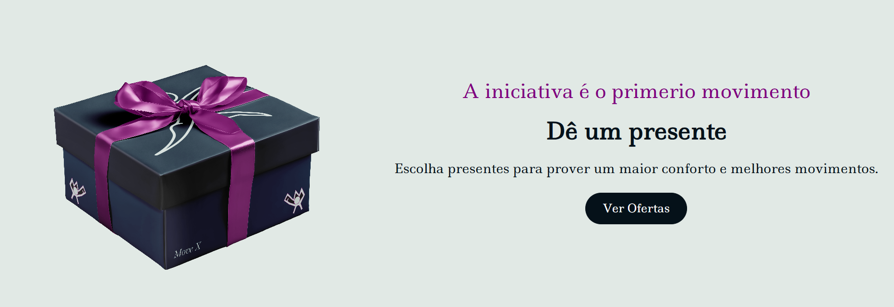

 

<h2 id="sobre">📌 Sobre</h2>
Este é um projeto de um site de uma loja de roupas esportivas, chamada MoveX. Este site foi feito com <strong>HTML</strong>, <strong>CSS</strong>, <strong>Javascript</strong> e <strong>Bootstrap</strong>, utilizando a prática <strong>Mobile First</strong>, com o objetivo de colocar em prática o que estudei, principalmente em <ins>Bootstrap</ins>. Também foi utilizada uma Biblioteca chamada <strong><a href="https://swiperjs.com/">Swiper</a></strong>, para facilitar a implementação de um elemento e o <strong>Git</strong> para controle de versões.
 
 

<h2 id="acesso">🚀 Acesse o Projeto</h2>
Veja o projeto você mesmo: https://joaovitordomingos.github.io/moveX/
 
 

<h2 id="detalhamento">📋 Detalhamento</h2>

Nesta sessão detalharei sobre o projeto, citando os pontos mais importantes sobre ele e sua criação.

  
<h3>Sumário</h3>

  <ol>
    <li><a href="#mobile_first">Mobile First</a></li>
    <li><a href="#menu">Menu de Navegação</a></li>
    <li><a href="#swiper">Carrossel - Biblioteca Swiper</a></li>
  </ol>

<h3 id="mobile_first">Mobile First</h3>

Foi utilizado a prática Mobile First para a criação do site, para garantir que nos dispositivos móveis o site não apresente nenhum problema visual e funcional.

Depois de finalizado a parte mobile, a criação se expandiu para telas maiores, como para tablet, notebook e no final computadores e telas maiores.

Deste modo há a garantia que o site estará funcional e visível para todos os tipos de telas e também não haverá nenhuma feature excluída para as telas menores, já que foi realizado em Mobile First.

Segue algumas imagens das partes do site em diferentes tamanhos de tela:

 
<h4 align="center">Área do menu e do Banner</h4>

  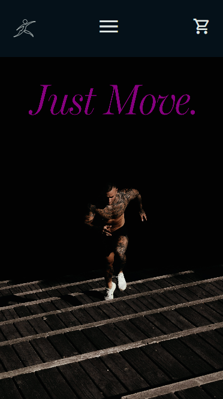
  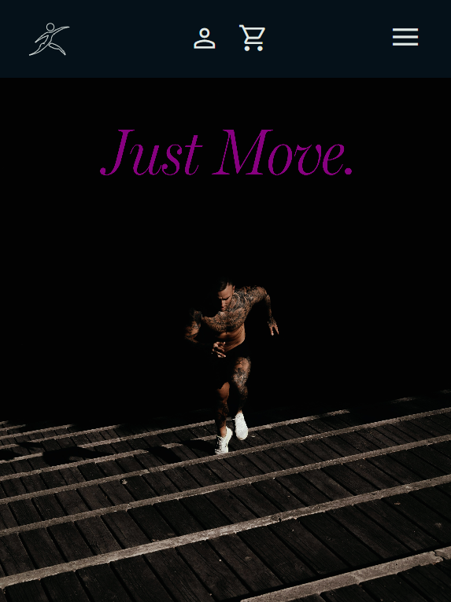
  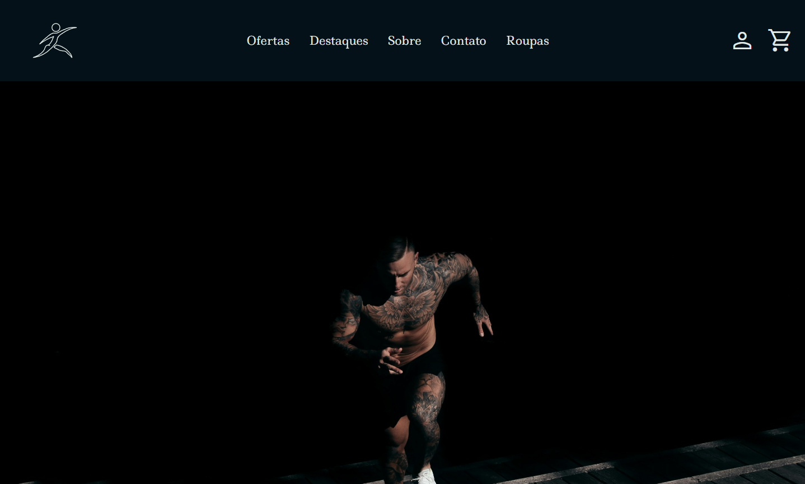

 
 
<h4 align="center">Área de Contato</h4>

  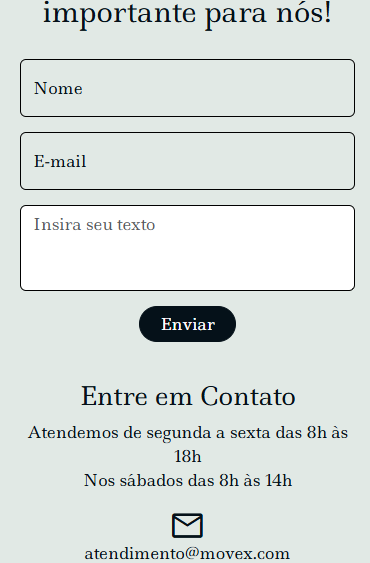
  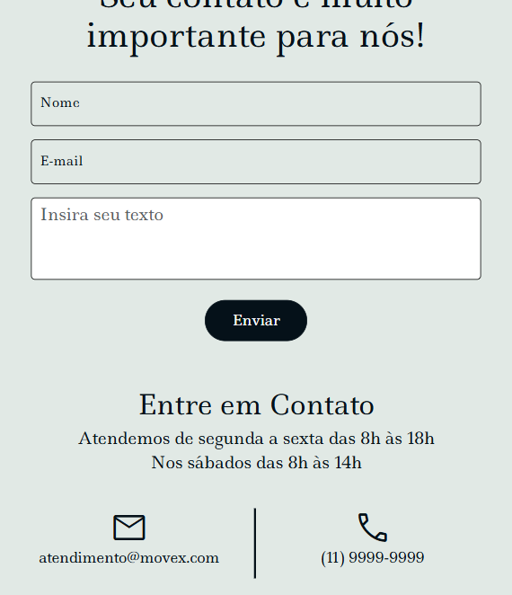
  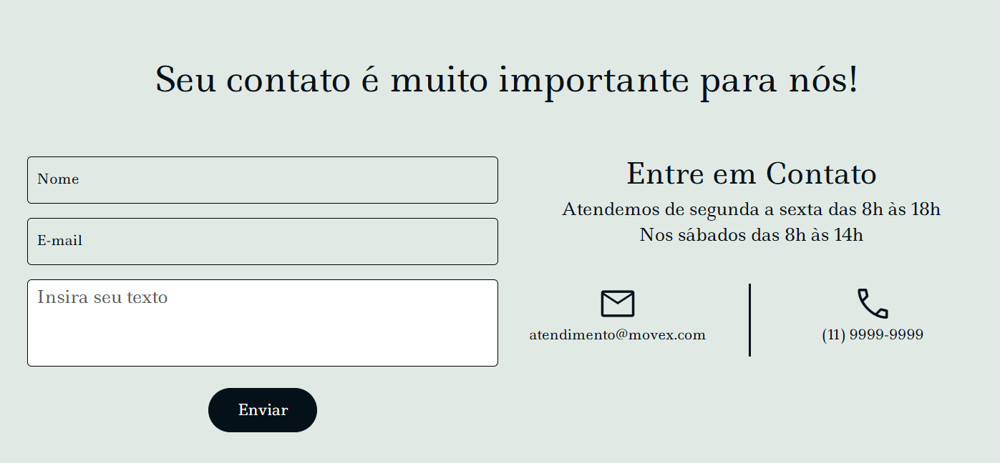

 
 

<h3 id="menu">Menu de Navegação</h3>

O menu de navegação em telas médias e grandes, notebook para cima, é completo, com logo, links e ícones, como mostra a imagem:

Porém, em telas menores como tablet e celulares, este menu é minimizado, é utilizado um menu hambúrguer.

  
  

Como é possível perceber, a posição do menu hambúrguer no celular é diferente do tablet, isso porque, no celular, ao expandir o menu hambúguer, ele cobre a tela toda, enquanto no tablet não e, também no tablet, é posicionado a direita.

<h4 align="center">Celular</h4>

  
  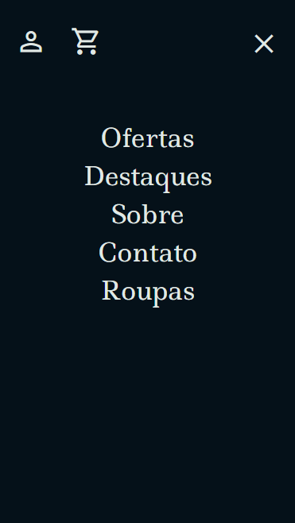

<h4 align="center">Tablet</h4>

  
  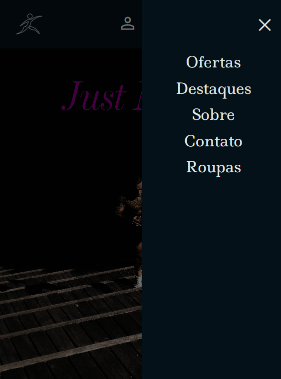

Para isto, foi utilizado Javascript. É pego a largura da tela do usuário e feito uma comparação simples, caso seja menor que 768px (celular) o elemento referente ao menu hambúrguer recebe a classe do Bootstrap <strong>"offcanvas-top"</strong>, caso seja maior, recebe a classe <strong>"offcanvas-end"</strong>

<strong>OBS: o menu hambúrguer foi feito com o Bootstrap.</strong>

  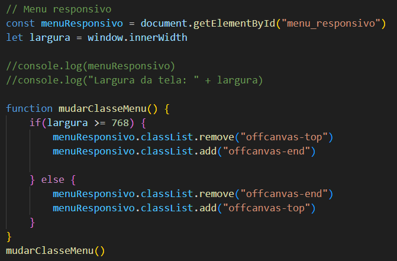

Também foi adicionado um evento de <strong>"resize"</strong> ao <i>window</i> para que sempre que o usuário mudar o tamanho da tela, durante o uso do site, não ocarra um erro, isso não sendo algo totalmente necessário.

  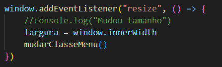

 
 

<h3 id="swiper">Carrossel - Biblioteca Swiper</h3>

Para o carrossel de produtos, não foi utilizado o do Bootstrap, mas sim da <a href="https://swiperjs.com/">Biblioteca Swiper</a>.

Isto porque, o Bootstrap não possui um carrossel com múltiplas imagens, então iria ser necessário adição de código personalizado. Para facilitar, foi utilizado o Swiper, que é focado em carrosseis.

<h4 align="center">Código do Swiper</h4>

  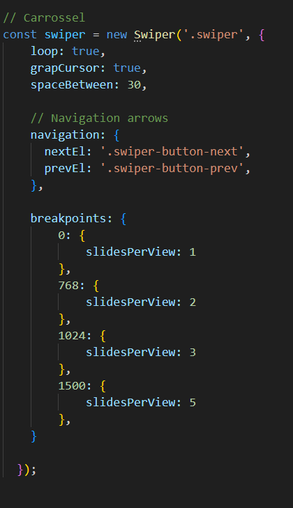

Para telas de celulares, é apresentado apenas uma imagem de cada vez. Para tablets, 2. Notebook, 3. E telas de 1500px pra cima, 5.

  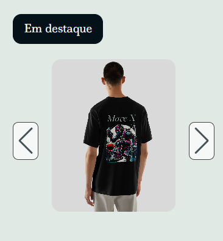
  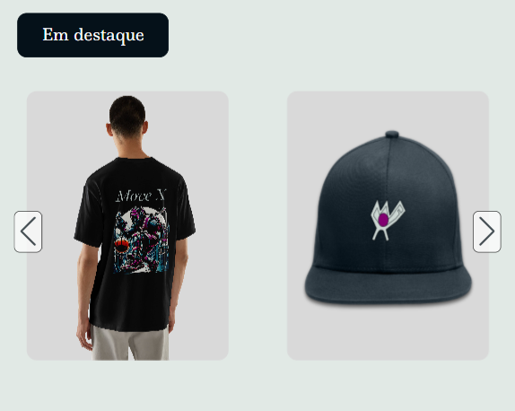
  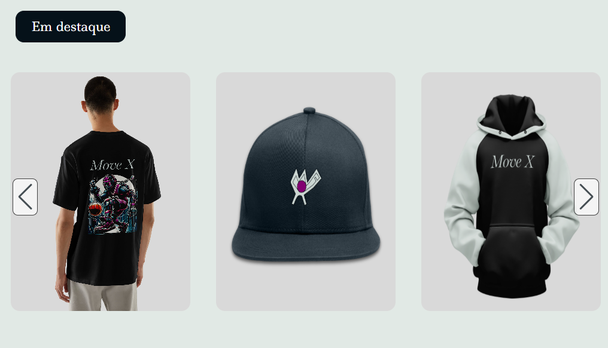
  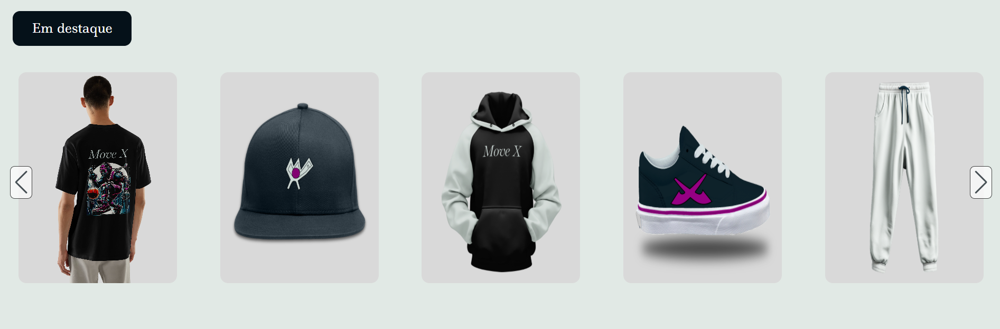

 
 

<h2 id="contribuidores">🤝 Contribuidores</h2>

Um agradecimento especial ao Luis Otávio, que criou todo o desing do site, imagens, cores e fontes.

<table>
  <tr>
    <td align="center">
      <a href="https://www.instagram.com/luiss_domingos/">
         
        
          <b>Luis Otávio C. Domingos</b>
        
      </a>
    </td>
  </tr>
</table>

 
 

<h2 id="licenca">📃 Licença</h2>
Veja a lincença do projeto: <a href="https://github.com/JoaoVitorDomingos/My-Class/tree/main?tab=MIT-1-ov-file">MIT License</a>
 
 
